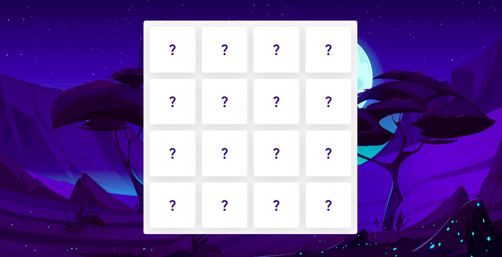

# Memory Card Game

This is a simple Memory Card Game that tests your memory skills.

## Learning

During the development of this project:

1. **Code Splitting**: We implemented code-splitting techniques to optimize the loading of our application.

2. **Optimizing State Management**: Refactored the application to centralize state management, creating a single source of truth for data. This architectural change streamlined our codebase and made it more maintainable.

3. **Confetti Package Integration**: Installed and integrated the "Confetti" package to add a fun and celebratory visual effect when users win a game round.

## Installation

1. Clone the repository.
2. Navigate to the project directory.
3. Run `npm install` to install the dependencies.
4. Start the game with `npm run dev`.

## Usage

To play the game, click on the cards to reveal their content. Match pairs of cards with the same content to win. Try to complete the game with as few moves as possible!

## Live Demo

[Play the Game](https://memory-card-game-blue.vercel.app/)
